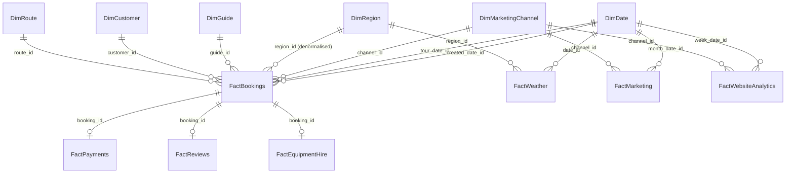

# Architecture

## Pipeline


*(Icons from [Lucide](https://lucide.dev), ISC license, recoloured to match the project theme. Same set used for the Power BI KPI card icons in `powerbi/assets/icons/`. Source SVG at `diagrams/architecture_diagram.svg` if you want to edit it.)*

Plain-text version, in case the image doesn't render wherever you're reading this:

```
Raw Data (CSV, synthetic + intentionally messy)
        │  src/generation/
        ▼
Python Cleaning & Validation
        │  src/cleaning/
        ▼
SQL Warehouse — Star Schema (SQLite)
        │  sql/schema/ + src/warehouse/
        ▼
Power BI Semantic Model + DAX
        │
        ▼
Executive & Departmental Dashboards
```

## Star schema

The warehouse is a Kimball-style star schema. One row per business event in each fact table, surrounded by dimensions describing the who/what/where/when.



*(Source at `diagrams/star_schema.mermaid`. Note this shows the schema's actual foreign keys, which isn't the same thing as which relationships Power BI has active vs. inactive. Those diverge in a few places, covered below.)*

Plain-text fallback:

```
                         DimDate
                            │
DimCustomer ─── FactBookings ─── DimRoute ─── DimRegion
                    │    │            │
                    │    └── DimGuide │
                    │                 │
              FactPayments      FactReviews
                                      │
                              FactEquipmentHire

DimMarketingChannel ─── FactMarketing
                    └─── FactWebsiteAnalytics

DimRegion ─── FactWeather ─── DimDate
```

### Dimensions

| Table | Grain | Notes |
|---|---|---|
| DimDate | one row per calendar day | Covers 2019–2025, plus a few extra days where payment/refund timestamps land just past year-end. Has a standard calendar season, a retail week (Sunday–Saturday: `week_start_date`/`week_end_date`/`week_number`/`retail_year`), and England & Wales bank holiday / English school summer holiday flags (`is_bank_holiday`, `is_summer_holiday`), computed by `src/utils/uk_calendar.py`. These flags actually feed back into how the booking dates get generated (bank holidays run at roughly 2.5x weekday revenue), rather than just describing dates after the fact. |
| DimRegion | one row per region | Aligned to `Region`. 7 regions: 6 originally synthetic, plus Yorkshire Dales, added specifically because one real route from the live app's fixture data didn't fit anywhere else. |
| DimGuide | one row per guide | Aligned to `Guide`, `primary_region_id` resolved to a real FK. Also has `discount_tendency_pct` [Ext]. Most guides rarely discount, a few do it a lot more, and that trait drives per-booking discounting on `FactBookings`. |
| DimRoute | one row per route | Aligned to `Route`, `region_id` resolved to a real FK. 53 routes: 30 synthetic, 27 pulled from the live app's `routes.json` fixture (4 near-duplicates got upgraded to the real data in place). Also carries `trailhead_lat`/`trailhead_lon` [Ext] for the Route dashboard's map. |
| DimCustomer | one row per unique contact email | Derived, not sourced. The real UK Summit Guides schema has no `Customer` entity, `Booking` just stores contact details inline. So the warehouse groups bookings on `contact_email` since that's the only stable identifier there is. A common enough real-world situation, worth documenting plainly rather than pretending it was always a proper table. |
| DimMarketingChannel | one row per channel | organic / direct / referral / paid_search / paid_social / email, with a `channel_type` (paid/unpaid) attribute. |

### Facts

| Table | Grain | Key measures |
|---|---|---|
| FactBookings | one row per booking | `party_size`, `list_price`, `discount_pct`, `discount_applied`, `total_price`, `lead_time_days` |
| FactPayments | one row per payment (1:1 with booking) | `amount` |
| FactReviews | one row per review (subset of bookings) | `overall_rating`, `guide_rating`, `route_rating`, `safety_rating`, `value_rating`, `comment_length` |
| FactEquipmentHire | one row per booking with equipment hired | `hire_revenue`, plus boolean flags per item |
| FactMarketing | one row per campaign/channel/month | `spend`, `clicks`, `impressions`, `conversions`, `revenue` |
| FactWebsiteAnalytics | one row per week/traffic-source/device | `sessions`, `users`, `bounce_rate`, `conversion_rate` |
| FactWeather | one row per date/region | `temperature_c`, `rain_mm`, `wind_speed_kmh`, `visibility_km`, `snow_depth_cm`, `storm_warning` |

### A few modelling calls worth explaining

`region_id` lives on `FactBookings` at the SQL level, denormalised, and `sql/queries/01_revenue_by_region.sql` still uses it directly. But in Power BI, only one relationship between two tables can be active at a time, and `DimRoute` already needs its own path to `DimRegion` (for a `RELATED()` calculated column and the Region → Route hierarchy, see `powerbi/readme.md`). Rather than fight over which direct-vs-via-route link gets to be active, I left `FactBookings → DimRegion` inactive and let `DimRoute → DimRegion` carry the filtering. Report-wise, nothing changes. Filtering by region still works, Power BI just takes one extra hop automatically. It's a decent example of a design that looked fine on paper and only ran into trouble once the BI layer got built against it.

`season` stays a degenerate dimension on `FactBookings` rather than getting its own table. It's a two-value field (`winter`/`summer`) straight from `ScheduledTour`, and a whole dimension table for two values buys nothing.

`DimCustomer` only stores identity: email, latest name, latest phone. Rebooking counts and lifetime value are measures calculated in DAX from `FactBookings`, not facts baked redundantly into the dimension.

There's no `DimTour` table. A `ScheduledTour` isn't really a describable "thing" beyond the route/guide/date/season it already carries. It's an event that produces `FactBookings` rows, so those attributes just live on the fact table instead of behind an extra join that wouldn't add anything.

`FactPayments` has two date columns, `paid_date_id` and `refunded_date_id`, and both ended up inactive in Power BI, not just the secondary one like I'd originally planned. `FactPayments` is 1:1 with `FactBookings`, and `FactBookings` already reaches `DimDate` actively through `tour_date_id`. If either payment date were also active, you'd get two paths to `DimDate` from `FactBookings` at once (direct, or via `FactPayments`), and Power BI won't allow that. Both payment-date measures in `dax_measures.md` use `USERELATIONSHIP()` to switch on whichever one's needed for a given calculation, rather than depending on either being active by default.

`DimGuide → DimRegion` (via `primary_region_id`) is also inactive, for the same underlying reason as the `FactBookings`/`DimRegion` case above. `FactBookings` already reaches `DimRegion` through `DimRoute`, so a second active path through `DimGuide` creates the identical ambiguous-path problem. I didn't actually catch this one until rebuilding the model from scratch after a table reimport. Autodetect proposed it as active by default, and it sat there with no visible error until I tried to actually use the relationship, at which point Power BI's ambiguous-path check caught it right away. Writing it down here so it doesn't get rediscovered the hard way a second time.