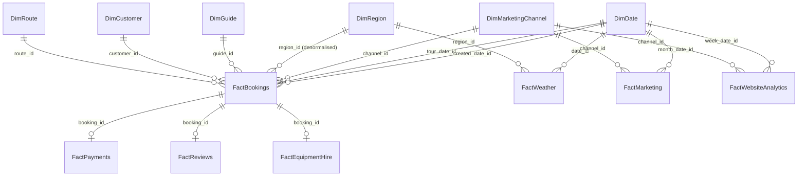

# Architecture

## Pipeline


*(Icons from [Lucide](https://lucide.dev), ISC license, recoloured to match the project theme — same icon set and pipeline used for the Power BI KPI card icons in `powerbi/assets/icons/`. Source SVG at `diagrams/architecture_diagram.svg` if you want to edit it directly.)*

A plain-text version of the same flow, for anywhere the image doesn't render:

```
Raw Data (CSV, synthetic + intentionally messy)
        │  src/generation/
        ▼
Python Cleaning & Validation
        │  src/cleaning/
        ▼
SQL Warehouse — Star Schema (SQLite)
        │  sql/schema/ + src/warehouse/
        ▼
Power BI Semantic Model + DAX
        │
        ▼
Executive & Departmental Dashboards
```

## Star schema

The warehouse is a Kimball-style star schema: one row per business event in each fact table, surrounded by dimension tables that describe the who/what/where/when of that event.



*(Source at `diagrams/star_schema.mermaid` if you want to edit it directly. This shows the schema's actual foreign keys, not the Power BI model's active/inactive relationship choices — see "Deliberate modelling decisions" below for where those two things diverge and why.)*

A plain-text version of the same relationships, for anywhere Mermaid doesn't render:

```
                         DimDate
                            │
DimCustomer ─── FactBookings ─── DimRoute ─── DimRegion
                    │    │            │
                    │    └── DimGuide │
                    │                 │
              FactPayments      FactReviews
                                      │
                              FactEquipmentHire

DimMarketingChannel ─── FactMarketing
                    └─── FactWebsiteAnalytics

DimRegion ─── FactWeather ─── DimDate
```

### Dimensions

| Table | Grain | Notes |
|---|---|---|
| DimDate | one row per calendar day | Spans the full 2019-2025 window (plus a few extra days from payment/refund timestamps landing just past year-end). Carries a standard meteorological calendar season, a **retail week** (Sunday-Saturday, `week_start_date`/`week_end_date`/`week_number`/`retail_year`), and **England & Wales bank holiday / English school summer holiday flags** (`is_bank_holiday`, `is_summer_holiday`) — computed by `src/utils/uk_calendar.py` and used to bias the generated booking dates themselves (bank holidays run at ~2.5x regular weekday revenue), not just to describe them after the fact |
| DimRegion | one row per region | Aligned to `Region`. 7 regions — 6 originally synthetic plus **Yorkshire Dales**, added specifically to accommodate a real route from the live app's fixture data that didn't fit any of the original 6 |
| DimGuide | one row per guide | Aligned to `Guide`, with `primary_region_id` resolved to a real FK. Also carries `discount_tendency_pct` [Ext] — a guide-level trait (most guides discount rarely, a few noticeably more) that drives per-booking discounting on FactBookings |
| DimRoute | one row per route | Aligned to `Route`, with `region_id` resolved to a real FK. 53 routes — 30 originally synthetic, 27 pulled from the live app's `routes.json` fixture (4 near-duplicates upgraded to the real data in place). Also carries `trailhead_lat`/`trailhead_lon` [Ext] for the Route dashboard's map visual |
| DimCustomer | one row per **unique contact email** | **Derived, not sourced** — the real UK Summit Guides schema has no `Customer` entity; `Booking` only stores contact details inline. The warehouse derives a customer dimension by grouping bookings on `contact_email`, since that's the only stable identifier available. This is a real, common warehouse-design situation (the source system wasn't built with analytics in mind) and is documented here rather than glossed over |
| DimMarketingChannel | one row per channel | organic / direct / referral / paid_search / paid_social / email, with a `channel_type` (paid/unpaid) grouping attribute |

### Facts

| Table | Grain | Key measures |
|---|---|---|
| FactBookings | one row per booking | `party_size`, `list_price`, `discount_pct`, `discount_applied`, `total_price`, `lead_time_days` |
| FactPayments | one row per payment (1:1 with booking) | `amount` |
| FactReviews | one row per review (subset of bookings) | `overall_rating`, `guide_rating`, `route_rating`, `safety_rating`, `value_rating`, `comment_length` |
| FactEquipmentHire | one row per booking with equipment hired | `hire_revenue`, plus boolean flags per item |
| FactMarketing | one row per campaign/channel/month | `spend`, `clicks`, `impressions`, `conversions`, `revenue` |
| FactWebsiteAnalytics | one row per week/traffic-source/device | `sessions`, `users`, `bounce_rate`, `conversion_rate` |
| FactWeather | one row per date/region | `temperature_c`, `rain_mm`, `wind_speed_kmh`, `visibility_km`, `snow_depth_cm`, `storm_warning` |

### Deliberate modelling decisions

- **`region_id` is denormalised onto `FactBookings` at the SQL level, but the *active* Power BI relationship routes through `DimRoute` instead.** The column still exists on `FactBookings` (and the SQL query library in `sql/queries/` still uses it directly — see `01_revenue_by_region.sql`), so the denormalisation is real and still pays off for hand-written SQL. But Power BI only allows one *active* relationship between any two tables, and `DimRoute` independently needs a path to `DimRegion` (for a `RELATED()` calculated column and the Region → Route hierarchy — see `powerbi/README.md`). Rather than have both `FactBookings → DimRegion` (direct) and `FactBookings → DimRoute → DimRegion` (via route) both wanting to be active, the direct link is set **inactive** in the Power BI model and `DimRoute → DimRegion` carries the traffic instead. Filtering `FactBookings` by region still works identically from a report-building perspective — it just takes one extra hop, which Power BI resolves automatically. This is a good example of a modelling choice that looked right on paper (optimise the fact table for the common case) turning out to conflict with a real downstream need once the BI tool was actually built against it — worth knowing before, not after, if you're extending this schema further.
- **`season` stays a degenerate dimension on `FactBookings`** rather than becoming its own table — it's a two-value attribute (`winter`/`summer`) sourced directly from `ScheduledTour`, and a full dimension table for two values would add a join with no analytical benefit.
- **`DimCustomer` stores identity fields only** (email, latest name, latest phone) — not rebooking counts or lifetime value. Those are measures, calculated from `FactBookings` in DAX, not facts stored redundantly inside a dimension.
- **No `DimTour` table.** A `ScheduledTour` is really an event that generates `FactBookings` rows, not a describable "thing" beyond the route/guide/date/season it already carries — so those attributes live directly on the fact table rather than behind an extra join.
- **`FactPayments`' two date columns (`paid_date_id`, `refunded_date_id`) are both inactive relationships in Power BI**, not just the secondary one as originally planned. `FactPayments` is 1:1 with `FactBookings`, and `FactBookings` already has an active path to `DimDate` via `tour_date_id` — so *either* payment date being active simultaneously creates an ambiguous path (two ways to reach `DimDate` from `FactBookings`: directly, or via `FactPayments`). Both payment-date measures in `dax_measures.md` use `USERELATIONSHIP()` to activate the relevant one temporarily, rather than relying on either being the model's default active path.
- **`DimGuide → DimRegion` (via `primary_region_id`) is inactive in Power BI**, for the same class of reason as the `FactBookings → DimRegion` denormalisation above: `FactBookings` already reaches `DimRegion` through `DimRoute`, so a *second* active path via `DimGuide` creates the identical ambiguous-path conflict. This one wasn't caught until the Power BI model was rebuilt from scratch after a table reimport — Autodetect proposed it as Active by default, and it produced no visible error until the relationship was manually attempted, at which point Power BI's ambiguous-path check caught it immediately. Documented here so it isn't rediscovered the hard way a second time.