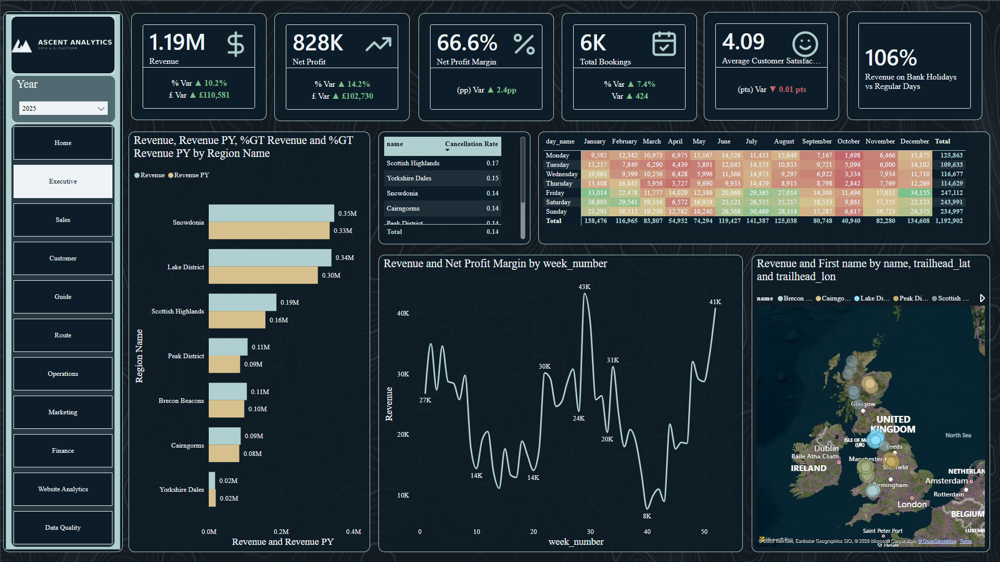
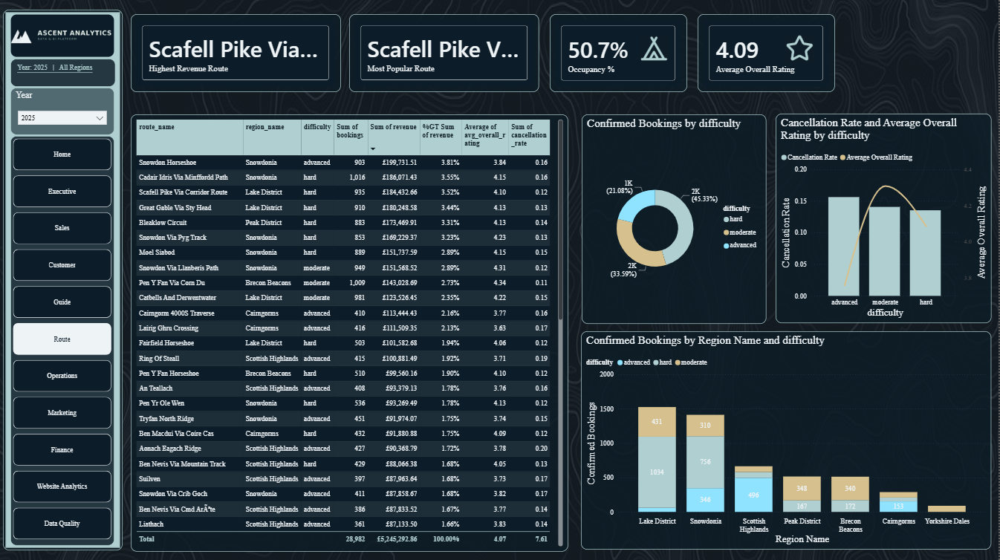
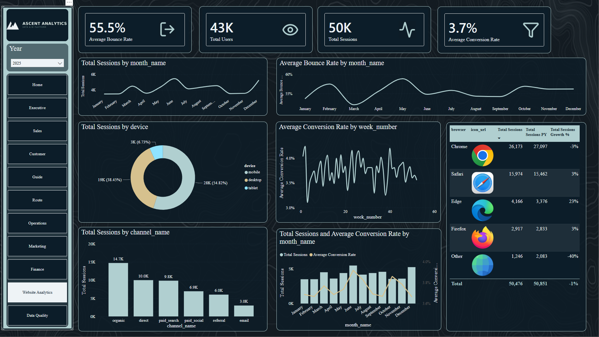

# ⛰️ Ascent Analytics

[]()
[]()
[]()
[]()
[]()

> The analytics companion to **[UK Summit Guides](https://github.com/TGOSS1984/uk-summit-guides)** — a full end-to-end BI platform that takes raw, messy operational data and turns it into a governed warehouse, a documented KPI catalogue, and an executive-ready Power BI reporting suite.

---

## 📚 Table of Contents

- [📖 Overview](#-overview)
- [🎯 Business Problem & KPIs](docs/business_problem.md)
- [🔗 Relationship to UK Summit Guides](#-relationship-to-uk-summit-guides)
- [🧱 Data Model](#-data-model)
- [🏗️ Architecture](#️-architecture)
- [🛠️ Tech Stack](#️-tech-stack)
- [📂 Project Structure](#-project-structure)
- [🧹 Data Cleaning](#-data-cleaning)
- [🗃️ SQL Warehouse](#️-sql-warehouse)
- [📊 KPIs & Dashboards](#-kpis--dashboards)
- [🔍 Data Quality](#-data-quality)
- [⚙️ Local Setup](#️-local-setup)
- [🗺️ Roadmap](#️-roadmap)
- [Known Limitations & Next Steps](#known-limitations--next-steps)
- [📌 Notes on Realism & Scope](#-notes-on-realism--scope)

---

## 📖 Overview

**Ascent Analytics** is a self-contained Business Intelligence project built around a synthetic but realistic dataset for a small UK-based guided mountain tour operator. It exists to demonstrate the full analytics lifecycle a data analyst is expected to own:

`Raw data → Python cleaning → SQL warehouse (star schema) → Power BI semantic model → Executive dashboards → Written insight & recommendations`

Rather than starting from a dashboard, this project starts from the same place a real analyst would: messy, imperfect operational data that needs to be understood, validated, cleaned, modelled, and only then visualised.

## 🔗 Relationship to UK Summit Guides

[UK Summit Guides](https://github.com/TGOSS1984/uk-summit-guides) is a live full-stack booking platform (React + Django REST Framework + PostgreSQL) for a small guided mountain tour company. Ascent Analytics is designed as its data/BI counterpart:

- **Core entities are aligned 1:1** with the real Django models (`Region`, `Guide`, `Route`, `ScheduledTour`, `Booking`, `Payment`) — same field names, same business rules (e.g. max party size of 3, difficulty levels of `moderate`/`hard`/`advanced`, seasons of `winter`/`summer` only).
- **Extended entities** (`Weather`, `Marketing`, `WebsiteAnalytics`, `EquipmentHire`, `Review`) do **not** exist in the live application. They're generated synthetically to demonstrate warehouse modelling and KPI work across a fuller commercial data estate. This is documented explicitly — see [Notes on Realism & Scope](#-notes-on-realism--scope) — rather than implied as real production data.

## 🧱 Data Model

_Full data dictionary lives in [`docs/data_dictionary/`](docs/data_dictionary/) — filled in as each entity is built._

| Entity | Source of truth | Status |
|---|---|---|
| Region | Aligned to `routes_app.Region` | 🔲 Not yet built |
| Guide | Aligned to `routes_app.Guide` | 🔲 Not yet built |
| Route | Aligned to `routes_app.Route` | 🔲 Not yet built |
| ScheduledTour | Aligned to `bookings.ScheduledTour` | 🔲 Not yet built |
| Booking | Aligned to `bookings.Booking` | 🔲 Not yet built |
| Payment | Aligned to `payments.Payment` | 🔲 Not yet built |
| Review | Synthetic extension | 🔲 Not yet built |
| Weather | Synthetic extension | 🔲 Not yet built |
| Marketing | Synthetic extension | 🔲 Not yet built |
| WebsiteAnalytics | Synthetic extension | 🔲 Not yet built |
| EquipmentHire | Synthetic extension | 🔲 Not yet built |

## 🏗️ Architecture

```
Raw Data (CSV, synthetic + intentionally messy)
        │
        ▼
Python Cleaning & Validation  (src/cleaning)
        │
        ▼
SQL Warehouse — Star Schema  (sql/schema)
        │
        ▼
Power BI Semantic Model + DAX  (powerbi/)
        │
        ▼
Executive & Departmental Dashboards
        │
        ▼
Insight Report & Recommendations  (docs/)
```

## 🛠️ Tech Stack

- **Python** — pandas, NumPy, Faker (synthetic data), pandera (validation)
- **SQL** — SQLite for development, with Postgres-compatible DDL for production
- **Power BI** — DAX measures, star-schema semantic model
- **Git/GitHub** — incremental, documented commit history
- **Markdown** — architecture docs, data dictionary, KPI catalogue

## 📂 Project Structure

```
ascent-analytics/
├── data/
│   ├── raw/            # Generated "messy" source data
│   ├── cleaned/         # Post-cleaning outputs
│   └── warehouse/       # SQLite warehouse database
├── src/
│   ├── generation/      # Synthetic data generation scripts
│   ├── cleaning/        # Cleaning & validation pipeline
│   └── utils/           # Shared helpers
├── sql/
│   ├── schema/          # DDL for fact/dimension tables
│   ├── views/            # Reporting views
│   ├── procedures/       # Stored procedures
│   └── queries/           # Analytical query library
├── notebooks/            # Exploratory analysis
├── powerbi/               # .pbix file + screenshots
├── docs/
│   ├── architecture/      # Architecture diagrams
│   ├── data_dictionary/   # Field-level documentation
│   ├── kpi_catalogue/      # KPI definitions & formulas
│   └── data_quality/       # Data quality scorecards
└── tests/                  # Pipeline tests
```

## 🧹 Data Cleaning

The Python cleaning pipeline (`src/cleaning/`) turns the deliberately messy raw CSVs into validated, warehouse-ready tables, in two stages:

```bash
python -m src.cleaning.run_pipeline              # core: Region, Guide, Route, ScheduledTour, Booking, Payment
python -m src.cleaning.run_pipeline_extensions    # extensions: Review, Weather, Marketing, BookingAttribution, WebsiteAnalytics, EquipmentHire
```

The extensions stage depends on the core stage's cleaned output (it validates `Review`/`EquipmentHire` bookings and `Weather` regions against the already-cleaned `Booking`/`Region` tables), so run core first.

What it does, per table:

- **Deduplication** — exact-duplicate rows (simulating double form submissions) are dropped and counted
- **Text normalisation** — inconsistent casing/whitespace in names, regions, and route names standardised to title case; closed-enum fields (status, difficulty, season, currency, channel, device) standardised to lowercase/uppercase as appropriate
- **Currency parsing** — values stored as `"£99.95"`, `"GBP 99.95"`, or `"£1,133.78"` all parse to a clean float
- **Email repair** — the one known corruption pattern (`@` replaced with `" at "`) is repaired automatically; anything else that still doesn't look like a valid email is flagged via `contact_email_invalid` rather than guessed at
- **Country-name standardisation** — `"UK"` / `"U.K."` / `"Great Britain"` / `"England"` all map to one canonical `"United Kingdom"`, with only genuine corrections counted in the quality log (not rows that were already canonical)
- **Missing-value handling** — some gaps are left as genuine gaps (a guide's missing qualifications, a review's missing sub-rating — inventing a value would be worse than admitting it's unknown); others are imputed with a documented, auditable rule (e.g. missing route elevation filled with the median for that difficulty tier) — see `docs/data_dictionary/README.md` for which rule applies to which field
- **Referential integrity checks** — every foreign key is checked against its parent table, with any orphans logged rather than silently dropped
- **Schema validation** — every cleaned table is validated against a [pandera](https://pandera.readthedocs.io/) schema (`src/cleaning/schemas.py`) enforcing types, ranges, and closed-enum values before it's written out

Every rule fires into a `QualityLog`, written to [`docs/data_quality/core_pipeline_log.csv`](docs/data_quality/core_pipeline_log.csv) and [`docs/data_quality/extension_pipeline_log.csv`](docs/data_quality/extension_pipeline_log.csv) — row counts by stage, duplicates removed, values imputed/repaired, and validation failure counts. This is the same log data the Data Quality Dashboard will visualise.

## 🗃️ SQL Warehouse

A Kimball-style star schema, built in SQLite (with Postgres-portable DDL — see the notes at the bottom of `sql/schema/01_dimensions.sql`). Full design rationale, the schema diagram, and the deliberate modelling decisions (denormalised `region_id`, derived `DimCustomer`, no `DimTour`) are documented in [`docs/architecture/README.md`](docs/architecture/README.md).

Build it (after both cleaning pipeline stages):

```bash
python -m src.warehouse.build_warehouse
```

This creates `data/warehouse/ascent_analytics.db` from scratch: runs the DDL in `sql/schema/` (`01_dimensions.sql` → `02_facts.sql` → `03_indexes.sql`), then loads it from `data/cleaned/`. 6 dimension tables, 7 fact tables.

**DimCustomer is derived, not sourced** — the real UK Summit Guides schema has no `Customer` entity, so the warehouse builds one by grouping `Booking` rows on `contact_email`. This is a genuinely common real-world warehouse situation (the source system wasn't designed with analytics in mind) and is called out explicitly rather than presented as if a customer table existed all along.

Example query, once built:

```sql
SELECT r.name AS region, ROUND(SUM(fb.total_price), 2) AS revenue, COUNT(*) AS bookings
FROM FactBookings fb
JOIN DimRegion r ON fb.region_id = r.region_id
WHERE fb.status = 'confirmed'
GROUP BY r.name
ORDER BY revenue DESC;
```

### Views, procedures, and the query library

```bash
python -m src.warehouse.apply_views
```

This creates 7 reporting views (`sql/views/01_reporting_views.sql`) — `vw_bookings_enriched` (the wide, denormalised base most other views and ad hoc queries build on), plus `vw_monthly_revenue`, `vw_route_performance`, `vw_guide_performance`, `vw_customer_summary`, `vw_weather_flagged_cancellations`, and `vw_marketing_performance`.

**Stored procedures — an honest limitation.** SQLite doesn't support `CREATE PROCEDURE`. Rather than pretend otherwise, `sql/procedures/README.md` explains the gap, `sql/procedures/postgres_examples.sql` shows what the same logic looks like as real PL/pgSQL procedures (for the Postgres/SQL Server tech stack this project also targets), and `src/warehouse/procedures.py` provides the practical SQLite-compatible equivalent: parameterised Python functions (`guide_performance_report()`, `route_performance_report()`, `refresh_customer_ltv_snapshot()`) that wrap the same SQL and return a DataFrame.

The **analytical query library** (`sql/queries/`, 8 files) answers the core business questions from `docs/business_problem.md` directly in runnable SQL, demonstrating `INNER`/`LEFT`/`RIGHT JOIN`, `GROUP BY`/`HAVING`, `CASE`, and window functions (`RANK`, `ROW_NUMBER`, `LAG`, `LEAD`) across CTEs — see [`sql/queries/README.md`](sql/queries/README.md) for the full index of which file answers which question with which technique.

## 📊 KPIs & Dashboards

The Power BI semantic model is built from the exported star schema — see [`powerbi/README.md`](powerbi/README.md) for the full setup guide (import, relationships, role-playing dates, hierarchies, and applying the custom report theme) and [`powerbi/dax_measures.md`](powerbi/dax_measures.md) for the complete DAX measure library, organised by dashboard and cross-referenced to the KPI catalogue. The finished model itself lives at `powerbi/ascent_analytics.pbix` — open it directly in Power BI Desktop, or rebuild it from scratch using the guide.

A custom report theme, [`powerbi/ascent_analytics_theme.json`](powerbi/ascent_analytics_theme.json), is derived directly from **UK Summit Guides' own design tokens** — the same dark, moody mountain palette (winter ice-blue/slate alternating with summer gold/sage) as the live booking site, so the two projects share one visual identity.

```bash
python -m src.warehouse.export_for_powerbi
```

exports the star schema plus four pre-aggregated summary tables to `powerbi/data_export/`, ready for Power BI Desktop's Text/CSV import.

**Why CSV export rather than a live SQLite connection?** Power BI Desktop has no built-in SQLite connector — the alternative is installing and configuring a third-party ODBC driver for a single-user, file-based database, which is unnecessary friction. This is explained in full in `powerbi/README.md`, including the ODBC option for anyone who wants it anyway.

All 10 dashboards are built and verified inside Power BI Desktop — see below for a look without needing to open the file yourself.

### Dashboard previews

**[📄 View all 10 dashboards as a PDF](powerbi/screenshots/Ascent_Analytics_Dashboards.pdf)** — exported directly from Power BI Desktop (File → Export → Export to PDF), one page per dashboard, in tab order. Renders inline in GitHub's file viewer, no download or Power BI install needed.

| Executive | Route |
|---|---|
|  |  |

| Website Analytics |
|---|
|  |

The dashboards answer *what's happening*; [`docs/insight_report.md`](docs/insight_report.md) answers *so what* — ten findings pulled directly from the warehouse (bank holiday demand spikes, difficulty-driven cancellation risk, channel ROAS, guide discount behaviour, and more), each with a specific recommendation, not just a chart.

## 🔍 Data Quality

Cleaning is a separate, auditable pipeline step — every raw table is checked against a [pandera](https://pandera.readthedocs.io/) schema before and after cleaning, and every fix the cleaning step makes is logged with a row count and a plain-English reason rather than applied silently. The **Data Quality** dashboard surfaces both sides of that log directly from the warehouse:

- **0 validation failures** across all 12 tables post-cleaning, and **99.8% average completeness** — the small remainder is intentional, not a gap (see below).
- **151,477 cleaned rows** across all tables (302,954 raw+cleaned combined), spanning everything from `Booking` and `Payment` (28,919 rows each) down to reference tables like `Region` (6 rows).
- **11,519 individual field-level fixes** logged, the largest being:
  - `currency_casing_fixed` — 7,053 payment records with inconsistent currency-code casing normalised
  - `country_names_standardised` — 2,019 website-analytics rows (e.g. `'UK'`/`'U.K.'` → `'United Kingdom'`)
  - `malformed_emails_repaired` — 881 booking emails fixed against an `' at '` → `'@'` pattern
  - review-rating nulls left as **null**, not imputed, across `missing_guide_rating` (305), `missing_value_rating` (317), `missing_route_rating` (342) and `missing_safety_rating` (350) — a 1–5 rating has no honest default, so these are surfaced as missing rather than guessed
  - `missing_qualifications` — 1 guide record flagged rather than imputed, a real data gap worth surfacing rather than papering over

That last principle — flag and leave null instead of inventing a plausible-looking value — is the throughline of the cleaning design: the dashboard's job is to make what was *actually* fixed (and what was deliberately left alone) visible, not to claim a cleaner dataset than what's really there.

Full fix-by-fix detail lives in `docs/data_quality/`; the pandera schemas enforcing this at pipeline runtime are in `src/cleaning/`.

## ⚙️ Local Setup

```bash
git clone <repo-url>
cd ascent-analytics
python -m venv .venv
source .venv/bin/activate   # Windows: .venv\Scripts\Activate.ps1
pip install --upgrade pip
pip install -r requirements.txt
```

Notebooks (`notebooks/`) need an extra, optional install — kept separate because `jupyter` pulls in `jupyterlab`'s large, deeply-nested asset tree, which can hit Windows' path-length limit (especially inside a OneDrive-synced folder):

```bash
pip install -r requirements-notebook.txt
```

If that fails on Windows with an `OSError` about a missing nested file path, see the comment at the top of `requirements-notebook.txt` for how to enable Windows Long Path support, or just work from a shorter path (e.g. `C:\dev\ascent-analytics`) outside OneDrive.

Then run the full pipeline. Easiest way — one command, works identically on Windows/macOS/Linux:

```bash
python run_pipeline.py          # full pipeline
python run_pipeline.py --test   # full pipeline, then the full test suite
```

On macOS/Linux, `make pipeline` (or `make all` to include tests) does the same thing — see the `Makefile`. Windows users should stick to `run_pipeline.py`, since `make` isn't available out of the box.

**Or run each of the 8 steps individually**, if you want to inspect output between stages:

```bash
python -m src.generation.generate_reference_data
python -m src.generation.generate_transactions
python -m src.generation.generate_extensions
python -m src.cleaning.run_pipeline
python -m src.cleaning.run_pipeline_extensions
python -m src.warehouse.build_warehouse
python -m src.warehouse.apply_views
python -m src.warehouse.export_for_powerbi
```

## 🗺️ Roadmap

- [x] Project skeleton & tooling
- [x] Business problem & KPI definition
- [x] Synthetic data generation (~7 years, ~30k bookings)
  - [x] Reference data: Region, Guide, Route
  - [x] Transactional data: ScheduledTour, Booking, Payment
  - [x] Extension data: Review, Weather, Marketing, WebsiteAnalytics, EquipmentHire
- [x] Data cleaning & validation pipeline (Python)
  - [x] Core entities: Region, Guide, Route, ScheduledTour, Booking, Payment
  - [x] Extension entities: Review, Weather, Marketing, WebsiteAnalytics, EquipmentHire
- [x] Dimensional model design (star schema) — see `docs/architecture/README.md`
- [x] SQL warehouse build (schema, views, procedures, indexes)
- [x] Power BI semantic model & DAX measures
  - [x] Star schema export + setup guide + full DAX measure library (`powerbi/`)
  - [x] Built and verified inside Power BI Desktop (.pbix file)
- [x] Dashboards: Executive, Sales, Customer, Guide, Route, Marketing, Operations, Finance, Website Analytics, Data Quality — all 10 built and verified
- [x] Written insight report & recommendations — see [`docs/insight_report.md`](docs/insight_report.md)
- [x] Full documentation pass (architecture, data dictionary, KPI catalogue)

## Known Limitations & Next Steps

An honest account of what this project doesn't yet do, rather than presenting it as finished in every respect:

- **No CI.** ~~The 79-test suite runs locally but isn't wired into a GitHub Actions workflow yet~~ **Fixed** — see `.github/workflows/ci.yml`. Worth knowing: a CI file existed since the project's first commit but silently only exercised ~35 of 79 tests (it never ran the pipeline first, so most tests skipped rather than ran) — fixed to run the full pipeline before testing, with an explicit check that fails loudly if anything skips again.
- **No one-command reproduction.** ~~The full pipeline is currently 8 manual commands~~ **Fixed** — `python run_pipeline.py` (or `make pipeline` on Unix/macOS) runs all 8 steps in order, stopping clearly on the first failure rather than continuing on bad data. The README's setup instructions had also only ever documented 3 of the 8 steps (generation only, never cleaning/warehouse/export) — fixed at the same time.
- **The `.pbix` file is a black box on GitHub.** ~~It's binary, doesn't render in a repo preview, and requires Power BI Desktop to open at all.~~ **Structure in place, pending the actual export files** — see the new "Dashboard previews" section above. A full PDF export (all 10 pages, renders inline in GitHub) plus 3 inline PNG previews (Executive, Route, Finance).
- **The Power BI semantic model isn't version-controlled the way the code is.** This turned out to be a real, recurring source of friction over the course of the project — see [`docs/powerbi_lessons_learned.md`](docs/powerbi_lessons_learned.md) for a full account of what a single schema change actually costs to rebuild, and why. The named next step is **Tabular Editor + TMDL**, which would let the semantic model live as reviewable text files alongside the Python and SQL, rather than trapped inside a binary file.
- **No productionization narrative.** Everything here is correctly scoped as a demo (SQLite, a single local `.pbix`) — worth a short written note on what would change for a real deployment (Postgres instead of SQLite, scheduled refresh, row-level security, a real ingestion API instead of CSVs) to make clear where the demo's edges are.

## 📌 Notes on Realism & Scope

This project favours **credibility over scale**. UK Summit Guides is a small guiding operation with groups capped at 3 people — so the dataset targets ~7 years of history and ~30,000 bookings rather than an inflated multi-million-row figure. Every entity that extends beyond the real UK Summit Guides schema (weather, marketing, website analytics, equipment hire, reviews) is clearly labelled as a synthetic extension, both here and in the data dictionary, so the provenance of every field is honest and traceable.