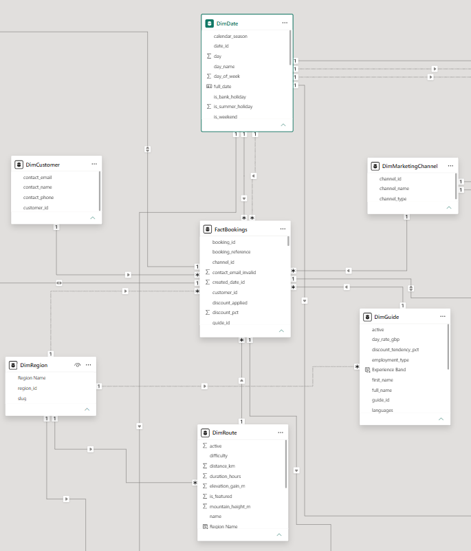

# ⛰️ Ascent Analytics

[]()
[]()
[]()
[]()
[]()

> The analytics companion to **[UK Summit Guides](https://github.com/TGOSS1984/uk-summit-guides)**: a full BI build that takes messy operational data and turns it into a proper warehouse, a documented KPI catalogue, and a Power BI reporting suite you could actually hand to a manager.

---

## 📚 Table of Contents

- [📖 Overview](#-overview)
- [🎯 Business Problem & KPIs](docs/business_problem.md)
- [🔗 Relationship to UK Summit Guides](#-relationship-to-uk-summit-guides)
- [🧱 Data Model](#-data-model)
- [🏗️ Architecture](#️-architecture)
- [🛠️ Tech Stack](#️-tech-stack)
- [📂 Project Structure](#-project-structure)
- [🧹 Data Cleaning](#-data-cleaning)
- [🗃️ SQL Warehouse](#️-sql-warehouse)
- [📊 KPIs & Dashboards](#-kpis--dashboards)
- [🔍 Data Quality](#-data-quality)
- [⚙️ Local Setup](#️-local-setup)
- [🗺️ Roadmap](#️-roadmap)
- [Known Limitations & Next Steps](#known-limitations--next-steps)
- [📌 Notes on Realism & Scope](#-notes-on-realism--scope)

---

## 📖 Overview

Ascent Analytics is a BI project built around a synthetic but realistic dataset for a small UK guided-mountain-tour operator. It's meant to show the whole analytics lifecycle, not just a dashboard at the end:

`Raw data → Python cleaning → SQL warehouse (star schema) → Power BI semantic model → dashboards → written insight`

Most portfolio BI projects start from the dashboard. This one starts where a real analyst actually starts: with messy data nobody's cleaned yet.

## 🔗 Relationship to UK Summit Guides

[UK Summit Guides](https://github.com/TGOSS1984/uk-summit-guides) is a live full-stack booking platform (React + Django REST Framework + PostgreSQL) I built for a small guided mountain tour company. Ascent Analytics is the data/BI side of that same project.

The core entities line up 1:1 with the real Django models: `Region`, `Guide`, `Route`, `ScheduledTour`, `Booking`, `Payment`. Same field names, same business rules: max party size of 3, difficulty levels of `moderate`/`hard`/`advanced`, seasons limited to `winter`/`summer`.

A handful of entities go beyond what the live app actually has: `Weather`, `Marketing`, `WebsiteAnalytics`, `EquipmentHire`, `Review`. None of these exist in production. They're synthetic, added to give the warehouse and the KPI work more to chew on than a small booking app naturally produces. See [Notes on Realism & Scope](#-notes-on-realism--scope) for the full breakdown of what's real and what isn't.

## 🧱 Data Model

Full field-level documentation is in [`docs/data_dictionary/`](docs/data_dictionary/): every column, its type, where it came from, and any cleaning rule that touched it.

| Entity | Source of truth | Status |
|---|---|---|
| Region | Aligned to `routes_app.Region` | ✅ Built |
| Guide | Aligned to `routes_app.Guide` | ✅ Built |
| Route | Aligned to `routes_app.Route` | ✅ Built |
| ScheduledTour | Aligned to `bookings.ScheduledTour` | ✅ Built |
| Booking | Aligned to `bookings.Booking` | ✅ Built |
| Payment | Aligned to `payments.Payment` | ✅ Built |
| Review | Synthetic extension | ✅ Built |
| Weather | Synthetic extension | ✅ Built |
| Marketing | Synthetic extension | ✅ Built |
| WebsiteAnalytics | Synthetic extension | ✅ Built |
| EquipmentHire | Synthetic extension | ✅ Built |

## 🏗️ Architecture

```
Raw Data (CSV, synthetic + intentionally messy)
        │
        ▼
Python Cleaning & Validation  (src/cleaning)
        │
        ▼
SQL Warehouse — Star Schema  (sql/schema)
        │
        ▼
Power BI Semantic Model + DAX  (powerbi/)
        │
        ▼
Executive & Departmental Dashboards
        │
        ▼
Insight Report & Recommendations  (docs/)
```

### Star schema



`FactBookings` sits in the middle, with the 6 dimensions around it. This is a real screenshot from the actual model, not a redrawn version, so it shows the real relationships, including the ones I deliberately left inactive. `docs/architecture/readme.md` has the full breakdown of every table and why each modelling call was made.

## 🛠️ Tech Stack

- **Python** — pandas, NumPy, Faker for synthetic data, pandera for schema validation
- **SQL** — SQLite for dev, Postgres-compatible DDL for production
- **Power BI** — DAX measures, star-schema semantic model
- **Git/GitHub** — commit history you can actually follow
- **Markdown** — architecture docs, data dictionary, KPI catalogue

## 📂 Project Structure

```
ascent-analytics/
├── data/
│   ├── raw/            # Generated "messy" source data
│   ├── cleaned/         # Post-cleaning outputs
│   └── warehouse/       # SQLite warehouse database
├── src/
│   ├── generation/      # Synthetic data generation scripts
│   ├── cleaning/        # Cleaning & validation pipeline
│   └── utils/           # Shared helpers
├── sql/
│   ├── schema/          # DDL for fact/dimension tables
│   ├── views/            # Reporting views
│   ├── procedures/       # Stored procedures
│   └── queries/           # Analytical query library
├── notebooks/            # Exploratory analysis
├── powerbi/               # .pbip project (semantic model + report) + screenshots
├── docs/
│   ├── architecture/      # Architecture diagrams
│   ├── data_dictionary/   # Field-level documentation
│   ├── kpi_catalogue/      # KPI definitions & formulas
│   └── data_quality/       # Data quality scorecards
└── tests/                  # Pipeline tests
```

## 🧹 Data Cleaning

`src/cleaning/` takes the deliberately messy raw CSVs and turns them into validated, warehouse-ready tables. It runs in two stages:

```bash
python -m src.cleaning.run_pipeline              # core: Region, Guide, Route, ScheduledTour, Booking, Payment
python -m src.cleaning.run_pipeline_extensions    # extensions: Review, Weather, Marketing, BookingAttribution, WebsiteAnalytics, EquipmentHire
```

Run core first. The extensions stage checks `Review`/`EquipmentHire` bookings and `Weather` regions against the already-cleaned core tables, so it needs them to exist.

Per table, the pipeline handles:

- **Deduplication.** Exact-duplicate rows (double form submissions) get dropped and counted.
- **Text normalisation.** Inconsistent casing and whitespace in names/regions/routes gets standardised to title case. Closed-enum fields (status, difficulty, season, currency, channel, device) get forced to lowercase or uppercase depending on the field.
- **Currency parsing.** `"£99.95"`, `"GBP 99.95"`, `"£1,133.78"` — all of it parses to a clean float.
- **Email repair.** There's one known corruption pattern (`@` swapped for `" at "`), and it gets fixed automatically. Anything else that still doesn't look like an email gets flagged as `contact_email_invalid` instead of guessed at.
- **Country-name standardisation.** `"UK"`, `"U.K."`, `"Great Britain"`, `"England"` all collapse to `"United Kingdom"`. Only genuine corrections get logged; rows that were already canonical don't count.
- **Missing values, handled two different ways.** Some gaps stay gaps: a guide's missing qualifications, a review's missing sub-rating. Inventing a number there would be worse than admitting it's unknown. Others get filled with a documented rule (missing route elevation → median for that difficulty tier, for example). `docs/data_dictionary/readme.md` says which rule applies where.
- **Referential integrity checks.** Every foreign key gets checked against its parent table. Orphans get logged, not silently dropped.
- **Schema validation.** Every cleaned table runs through a [pandera](https://pandera.readthedocs.io/) schema (`src/cleaning/schemas.py`) before it's written out: types, ranges, closed enums, all enforced.

Every rule logs to a `QualityLog`, written to [`docs/data_quality/core_pipeline_log.csv`](docs/data_quality/core_pipeline_log.csv) and [`docs/data_quality/extension_pipeline_log.csv`](docs/data_quality/extension_pipeline_log.csv). Row counts, duplicates removed, values fixed, validation failures. It's all there, and it's the same data the Data Quality dashboard visualises.

## 🗃️ SQL Warehouse

A Kimball-style star schema in SQLite, with Postgres-portable DDL (see the notes at the bottom of `sql/schema/01_dimensions.sql`). The design rationale and the deliberate modelling calls (denormalised `region_id`, a derived `DimCustomer`, no `DimTour`) are all in [`docs/architecture/readme.md`](docs/architecture/readme.md).

Build it, once both cleaning stages have run:

```bash
python -m src.warehouse.build_warehouse
```

That creates `data/warehouse/ascent_analytics.db` from scratch. It runs the DDL in `sql/schema/` in order (`01_dimensions.sql` → `02_facts.sql` → `03_indexes.sql`), then loads it from `data/cleaned/`. 6 dimension tables, 7 fact tables.

`DimCustomer` is derived, not sourced. The real UK Summit Guides schema has no `Customer` entity, `Booking` just stores contact details inline. So the warehouse groups bookings on `contact_email` to build a customer dimension itself. This is a pretty normal warehouse situation to run into (the source system wasn't built with analytics in mind), and I'd rather document it plainly than pretend a customer table existed all along.

Example query, once it's built:

```sql
SELECT r.name AS region, ROUND(SUM(fb.total_price), 2) AS revenue, COUNT(*) AS bookings
FROM FactBookings fb
JOIN DimRegion r ON fb.region_id = r.region_id
WHERE fb.status = 'confirmed'
GROUP BY r.name
ORDER BY revenue DESC;
```

### Views, procedures, and the query library

```bash
python -m src.warehouse.apply_views
```

Creates 7 reporting views (`sql/views/01_reporting_views.sql`). `vw_bookings_enriched` is the wide, denormalised base most other views build on; the rest are `vw_monthly_revenue`, `vw_route_performance`, `vw_guide_performance`, `vw_customer_summary`, `vw_weather_flagged_cancellations`, and `vw_marketing_performance`.

Stored procedures are an honest gap. SQLite doesn't support `CREATE PROCEDURE`, full stop. `sql/procedures/readme.md` explains that, `sql/procedures/postgres_examples.sql` shows what the same logic would look like as real PL/pgSQL, and `src/warehouse/procedures.py` is the practical stand-in: parameterised Python functions (`guide_performance_report()`, `route_performance_report()`, `refresh_customer_ltv_snapshot()`) that wrap the SQL and hand back a DataFrame.

The query library (`sql/queries/`, 8 files) answers the core business questions from `docs/business_problem.md` in runnable SQL: `INNER`/`LEFT`/`RIGHT JOIN`, `GROUP BY`/`HAVING`, `CASE`, window functions (`RANK`, `ROW_NUMBER`, `LAG`, `LEAD`) over CTEs. [`sql/queries/readme.md`](sql/queries/readme.md) indexes which file answers which question with which technique.

## 📊 KPIs & Dashboards

The Power BI semantic model is built from the exported star schema. [`powerbi/readme.md`](powerbi/readme.md) has the full setup guide: import, relationships, role-playing dates, hierarchies, the custom theme. [`powerbi/dax_measures.md`](powerbi/dax_measures.md) has every DAX measure, organised by dashboard and cross-referenced to the KPI catalogue.

The model itself lives at `powerbi/ascent_analytics.pbip`. Open it directly in Power BI Desktop, or rebuild from scratch using the guide. Measures, relationships, and tables are stored as `.tmdl` text files rather than one binary blob. [`docs/tmdl_exploration.md`](docs/tmdl_exploration.md) covers why that matters.

The report theme, [`powerbi/ascent_analytics_theme.json`](powerbi/ascent_analytics_theme.json), pulls straight from UK Summit Guides' own design tokens, the same dark mountain palette (winter ice-blue/slate, summer gold/sage) as the live site, so both projects look like they belong together.

```bash
python -m src.warehouse.export_for_powerbi
```

Exports the star schema plus four pre-aggregated summary tables to `powerbi/data_export/`, ready for Power BI's Text/CSV import.

Why CSV rather than a live SQLite connection? Power BI Desktop has no built-in SQLite connector. The alternative is a third-party ODBC driver for a single-user file database, which felt like unnecessary friction for what this is. Full explanation, including the ODBC route if you want it anyway, is in `powerbi/readme.md`.

All 10 dashboards are built and working in Power BI Desktop. Previews below if you don't want to open the file.

### Dashboard previews

**[📄 View all 10 dashboards as a PDF](powerbi/screenshots/Ascent_Analytics_Dashboards.pdf)**, exported straight from Power BI Desktop, one page per dashboard, in tab order. Renders inline in GitHub, no download needed.

| Executive | Route |
|---|---|
|  |  |

| Website Analytics |
|---|
|  |

The dashboards show what's happening. [`docs/insight_report.md`](docs/insight_report.md) is the *so what*: ten findings pulled straight from the warehouse (bank holiday demand spikes, difficulty-driven cancellation risk, channel ROAS, guide discount behaviour), each with an actual recommendation attached, not just a chart and a shrug.

## 🔍 Data Quality

Cleaning is its own auditable step. Every raw table gets checked against a [pandera](https://pandera.readthedocs.io/) schema before and after cleaning, and every fix gets logged with a row count and a plain reason, not applied silently. The Data Quality dashboard shows both sides of that log:

- 0 validation failures across all 12 tables post-cleaning, 99.8% average completeness. The small remainder is intentional, more on that below.
- 151,477 cleaned rows across all tables (302,954 counting raw + cleaned), from `Booking` and `Payment` at 28,919 rows each down to small reference tables like `Region` at 6.
- 11,519 individual field-level fixes. The biggest ones:
  - `currency_casing_fixed` — 7,053 payment records with inconsistent currency-code casing
  - `country_names_standardised` — 2,019 website-analytics rows (`'UK'`/`'U.K.'` → `'United Kingdom'`)
  - `malformed_emails_repaired` — 881 booking emails fixed against the `' at '` → `'@'` pattern
  - review-rating gaps left as null, not guessed at, across `missing_guide_rating` (305), `missing_value_rating` (317), `missing_route_rating` (342), `missing_safety_rating` (350) — a 1–5 rating has no honest default
  - `missing_qualifications` — 1 guide record flagged rather than filled in

That last one's the general principle, really: flag and leave it null instead of inventing something plausible. The dashboard's job is to show what actually got fixed, and what got deliberately left alone, not to make the dataset look cleaner than it is.

Full detail lives in `docs/data_quality/`. The pandera schemas enforcing all this at runtime are in `src/cleaning/`.

## ⚙️ Local Setup

```bash
git clone <repo-url>
cd ascent-analytics
python -m venv .venv
source .venv/bin/activate   # Windows: .venv\Scripts\Activate.ps1
pip install --upgrade pip
pip install -r requirements.txt
```

Notebooks (`notebooks/`) need a separate install. `jupyter` pulls in `jupyterlab`'s large nested asset tree, which can hit Windows' path-length limit — especially inside a OneDrive-synced folder — so it's kept out of the main requirements file:

```bash
pip install -r requirements-notebook.txt
```

If that fails on Windows with an `OSError` about a missing nested path, check the comment at the top of `requirements-notebook.txt` for enabling Long Path support, or just work from somewhere shorter like `C:\dev\ascent-analytics`.

Then the pipeline. Easiest way, one command, same on Windows/macOS/Linux:

```bash
python run_pipeline.py          # full pipeline
python run_pipeline.py --test   # full pipeline, then the test suite
```

On macOS/Linux, `make pipeline` (or `make all` for tests too) does the same thing. Windows users, stick with `run_pipeline.py` — no `make` out of the box.

Or run the 8 steps by hand if you want to poke at the output between stages:

```bash
python -m src.generation.generate_reference_data
python -m src.generation.generate_transactions
python -m src.generation.generate_extensions
python -m src.cleaning.run_pipeline
python -m src.cleaning.run_pipeline_extensions
python -m src.warehouse.build_warehouse
python -m src.warehouse.apply_views
python -m src.warehouse.export_for_powerbi
```

## 🗺️ Roadmap

- [x] Project skeleton & tooling
- [x] Business problem & KPI definition
- [x] Synthetic data generation (~7 years, ~30k bookings)
  - [x] Reference data: Region, Guide, Route
  - [x] Transactional data: ScheduledTour, Booking, Payment
  - [x] Extension data: Review, Weather, Marketing, WebsiteAnalytics, EquipmentHire
- [x] Data cleaning & validation pipeline (Python)
  - [x] Core entities: Region, Guide, Route, ScheduledTour, Booking, Payment
  - [x] Extension entities: Review, Weather, Marketing, WebsiteAnalytics, EquipmentHire
- [x] Dimensional model design (star schema) — see `docs/architecture/readme.md`
- [x] SQL warehouse build (schema, views, procedures, indexes)
- [x] Power BI semantic model & DAX measures
  - [x] Star schema export + setup guide + full DAX measure library (`powerbi/`)
  - [x] Built and verified inside Power BI Desktop (.pbip project)
- [x] Dashboards: Executive, Sales, Customer, Guide, Route, Marketing, Operations, Finance, Website Analytics, Data Quality — all 10 built
- [x] Written insight report & recommendations — see [`docs/insight_report.md`](docs/insight_report.md)
- [x] Full documentation pass (architecture, data dictionary, KPI catalogue)

## Known Limitations & Next Steps

Here's what this project doesn't do, or didn't used to do, rather than pretending everything was smooth.

**CI was broken and I didn't notice for a while.** A workflow file existed from the first commit, but it never ran the pipeline first, so most of the 79 tests just skipped instead of running. Only ~35 were actually being exercised. Fixed now (`.github/workflows/ci.yml`), with a check that fails loudly if anything skips again rather than passing green on a lie.

**Reproduction used to be 8 manual commands, undocumented as such.** The README only ever walked through 3 of them. `python run_pipeline.py` (or `make pipeline` on Unix) now runs all 8 in order and stops clearly on the first failure.

**The `.pbix` file used to be a black box on GitHub.** Binary, no repo preview, needed Power BI Desktop just to look at it. Fixed two ways: the dashboard previews above (a full PDF export plus 3 inline PNGs), and separately, the semantic model itself moved from `.pbix` to `.pbip`, so it's not a binary blob at all anymore.

**The semantic model wasn't version-controlled the way the code was**, and that caused real pain. See [`docs/powerbi_lessons_learned.md`](docs/powerbi_lessons_learned.md) for what a single schema change used to cost to rebuild. Fixed via the same `.pbip` migration: native PBIP + TMDL support in Power BI Desktop (GA Feb 2026, no external tool needed) means measures, relationships, and tables are now reviewable `.tmdl` text files sitting next to the Python and SQL. [`docs/tmdl_exploration.md`](docs/tmdl_exploration.md) has the full rationale, plus what this does and doesn't fix.

**There was no productionization story.** Everything here is scoped as a demo on purpose: SQLite, one local `.pbip` file. [`docs/productionization.md`](docs/productionization.md) covers what would actually need to change for a real deployment: Postgres instead of SQLite, scheduled refresh, row-level security built on `DimRegion`, and a real ingestion path from the live UK Summit Guides app instead of synthetic CSVs.

## 📌 Notes on Realism & Scope

I aimed for credibility over scale. UK Summit Guides is a small operation, groups capped at 3 people, so the dataset targets ~7 years of history and ~30,000 bookings rather than an inflated multi-million-row number that wouldn't make sense for the business it's supposed to represent. Anything beyond the real UK Summit Guides schema (weather, marketing, website analytics, equipment hire, reviews) is labelled as a synthetic extension, here and in the data dictionary, so it's always clear which fields are real and which aren't.